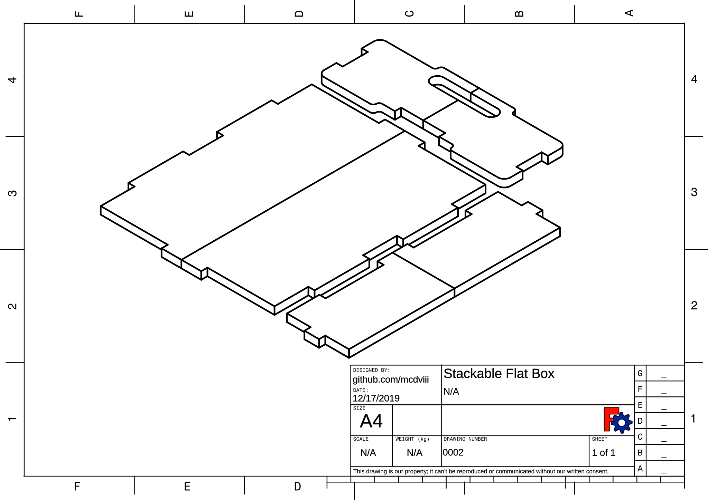

# FreeCAD Stackable Flat Box

Adjustable stackable flat box or tray, designed in FreeCAD. Design inspired by a [drawing found on
3axis.co](*).

## Goals/Features:

The aim of this project is to make a CAD file with all necessary shapes to make
a stackable tray. Additional goals are:

- Adjustable for all material thicknesses.
- Fully automated tab depth adjustment (changing material thickness changes tab
  depth by default).
- All dimensions kept in an associated spreadsheet for easy adjustment & repurposing.
- Shapes should hold true under any input dimension.
- Pockets along top & bottom edges to aid in stacking, automatically calculated
  form material thickness.
- All fitment features (such as tab width or handle size & placement) should automatically
  be calculated from:
  - Height
  - Width
  - Depth

## ToDO:

- [ ] Finish adding all relavant constraints to all solids, re-adding or
      removing constraints as necessary.
- [ ] Clean up spreadsheet calculations (remove redundancy).
- [ ] Confirm placement of each solid is calculated through its neighbor, in such a way that
      changing dimensions doesn't shift parts closer (or further away) from its neighbor.

## License:

All items in this project are released under the [GNU GPL v3.0 license](https://www.gnu.org/licenses/gpl-3.0.en.html).
